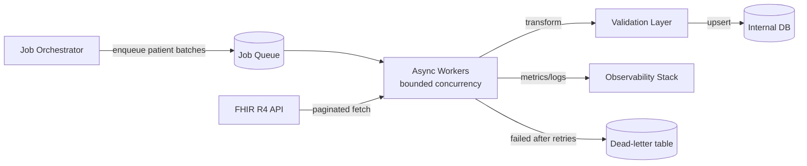

# FHIR Patient & Observation Migration Plan

## Overview

This document outlines a production-minded approach to migrating ~50,000 patient records and their associated observations from a legacy FHIR R4 API into an internal service.

The Part 2 working slice in this repo implements the same architecture at demo scale: Celery discovery + observation fan-out over Redis (see `backend/migration/tasks.py`), runnable via Docker Compose. The pieces listed at the end under "What I'd Build Next" are what remain for full 50k scale.

### High-Level Architecture



### Overall Approach

**First preference: FHIR Bulk Data Export.** If the legacy system supports `$export` (the FHIR Bulk Data Access spec), a single export of Patient and Observation as NDJSON files sidesteps rate limits and 100k+ REST calls entirely — we'd poll the export job, download the files, and run the same transform/validate/upsert pipeline over them. Many legacy systems don't support it, so the rest of this plan assumes the fallback: crawling the REST API.

**Asynchronous, queue-driven, idempotent migration.** A fully sequential migration is a non-starter at this scale: 50k patients plus at least one observation query each is 100k+ round trips, which at ~200ms per request is 6+ hours of pure network wait with no way to tune throughput. Instead, an orchestrator enqueues work and a pool of async workers processes it concurrently — with concurrency *explicitly bounded*, because the point of async here is not maximum parallelism but precise control over how hard we hit the source API.

1. **Discovery (sequential)** — Query `/Patient?_count=100&_elements=id` and follow `Bundle.link.relation=next` to enumerate all patient IDs. Pagination cursors are inherently sequential, so this phase stays synchronous — it's ~500 cheap requests. Persist a migration manifest row per patient (`patient_id, status=pending, checksum`) before any writes.
2. **Load (async, fan-out)** — The orchestrator enqueues patient batches (e.g., 50 IDs per task) onto a job queue (Celery + Redis, as in the working slice; `asyncio` + `aiohttp` within each worker would further multiply per-worker throughput). Each worker task fetches the patient's observations (`/Observation?patient={id}&_count=100`), transforms, and upserts. Independent patients have no ordering constraints, so this parallelizes cleanly.
3. **Reconciliation** — Compare source counts vs. destination counts per the manifest; flag discrepancies.

**Why async helps with API limits (and how we keep it safe)**

- **A shared token bucket** (e.g., 10 req/s across all workers) is the single throttle point. Sequential code couples throughput to per-request latency; async decouples them, so we can run *at* the negotiated rate budget instead of far under it — or dial it down instantly if the source system degrades.
- **Bounded concurrency**: a semaphore caps in-flight requests (start ~8–10). Unbounded async fan-out would just DDoS the legacy system.
- **Adaptive backpressure**: on 429/`Retry-After`, workers pause and the orchestrator halves the token rate; it ramps back up slowly after a clean window (AIMD, like TCP).

**Reliability**

- **Idempotency**: All writes use upsert on `fhir_id`. Re-running any batch produces the same result, which makes retries and crash recovery trivially safe.
- **Checkpointing via manifest**: Each patient's manifest row moves `pending → in_progress → done/failed`. Because batches complete out of order under async, there is no single "last processed ID" — resume simply re-enqueues everything not `done`.
- **Retries with exponential backoff**: Transient failures (429, 502, 503, timeouts) retry up to 5 times with jittered backoff (1s → 2s → 4s → 8s → 16s). Permanent failures (400, 404 on individual resources) are logged and skipped, not retried indefinitely.
- **Dead-letter queue**: Resources that fail after all retries are written to a `migration_errors` table with the raw payload, error type, and timestamp for manual review and targeted re-enqueue.
- **Stateless workers**: Any worker can crash mid-batch; the task is re-queued (visibility timeout / task acks) and the upsert makes the redo harmless.

**API Limits & Considerations**

| Concern | Mitigation |
|---------|------------|
| Rate limiting (429) | Honor `Retry-After`; shared token bucket + AIMD rate adjustment |
| Large bundles | `_count=100` with `_summary=false`; paginate via `next` links |
| Sandbox resets | Manifest tracks source server version; re-run full migration if upstream resets |
| Partial responses | Validate `Bundle.total` vs. fetched count |
| Network timeouts | 30s connect/read timeout; retry on timeout |
| Memory | Stream/process one page at a time; don't load 50k patients into memory |

**Observability**

- Structured JSON logs per batch: `{patient_id, status, duration_ms, observation_count, error}`
- Metrics: `migration.patients_processed`, `migration.observations_processed`, `migration.errors`, `migration.api_latency_p99`, `migration.queue_depth`, `migration.inflight_requests`, current token-bucket rate
- Dashboard: progress % (manifest `done` / total), error rate, ETA based on rolling throughput
- Alerting: error rate > 5%, queue not draining for > 10 minutes, or sustained 429s (rate budget misconfigured)

---

## Data Mapping

### FHIR Patient → Internal `Patient`

| FHIR Field | Internal Field | Notes |
|------------|----------------|-------|
| `id` | `fhir_id` (unique) | Stable external identifier |
| `name[].given[0]` | `given_name` | Prefer `use=official`, else first name entry with a given name |
| `name[].family` | `family_name` | Same preference order |
| `birthDate` | `birth_date` | ISO date |
| `gender` | `gender` | Enum: male, female, other, unknown |
| `identifier[].value` | `mrn` | Prefer identifier with type code `MR` (Medical Record Number), else first present |
| `meta.lastUpdated` | `source_updated_at` | For change detection in future syncs |

### FHIR Observation → Internal `Observation`

| FHIR Field | Internal Field | Notes |
|------------|----------------|-------|
| `id` | `fhir_id` (unique) | |
| `subject.reference` | `patient_id` (FK) | Parse `Patient/{id}` |
| `code.coding[0].code` | `code` | LOINC/SNOMED code |
| `code.coding[0].display` | `display` | Human-readable label |
| `valueQuantity.value` | `value_numeric` | Nullable |
| `valueQuantity.unit` | `unit` | e.g., "mg/dL" |
| `valueString` / `valueBoolean` / `valueCodeableConcept` | `value_text` | For non-quantity values |
| `component[]` | `value_text` | Multi-part observations (e.g. blood pressure) flattened to "label: value" pairs |
| `effectiveDateTime` | `effective_at` | |
| `status` | `status` | final, preliminary, etc. |
| `meta.lastUpdated` | `source_updated_at` | |

**Transformation rules**

- Skip resources missing required fields (`id`, `subject` for observations).
- Value extraction precedence: `valueQuantity` → `valueInteger` → `valueString` → `valueBoolean` → `valueCodeableConcept` → flattened `component[]`.
- Normalize patient reference: strip `Patient/` prefix.
- Store raw FHIR JSON in an optional `source_payload` column (encrypted at rest in production) for audit/replay.

---

## Validation

### Continuous Checks (during migration)

Cheap invariants run inline in the validation layer so a systematic bug surfaces after hundreds of patients, not after all 50k: required fields present, dates parseable, gender in enum, patient reference resolvable. Violations dead-letter the resource and increment an error metric that feeds the >5% alert.

### Automated Checks (run post-migration)

1. **Count reconciliation** — `COUNT(patients)` and `COUNT(observations)` in internal DB vs. FHIR `_summary=count` queries. Tolerance: 0 for patients, <0.1% for observations (some may be orphaned).
2. **Spot-check sampling** — Randomly select 100 patients; deep-compare transformed fields against source FHIR resource.
3. **Referential integrity** — No observations with dangling `patient_id` FK.
4. **Duplicate detection** — `SELECT fhir_id, COUNT(*) ... HAVING COUNT(*) > 1` returns zero rows.
5. **Schema validation** — All required fields non-null; dates parse correctly; gender in allowed enum.
6. **Checksum audit** — Hash of `(given_name, family_name, birth_date, observation_count)` per patient; compare against manifest captured at fetch time.

### Manual Review

- Review `migration_errors` table for systematic failure patterns.
- Clinician spot-check on 10 random patient profiles for clinical plausibility.

---

## Safety (PHI Handling)

In a real deployment with actual patient data:

| Control | Implementation |
|---------|----------------|
| **Data minimization** | HIPAA "minimum necessary" standard: only map fields needed by downstream services; don't store full FHIR bundles unless required |
| **Least privilege** | Migration service account holds read-only scopes on the source FHIR API (e.g. SMART `system/Patient.read`, `system/Observation.read`) |
| **Encryption at rest** | AES-256 on DB columns containing PHI; encrypted volumes |
| **Encryption in transit** | TLS 1.2+ for all API calls; mTLS to upstream if available |
| **Access control** | RBAC on internal API; audit log every read of patient data |
| **Environment isolation** | Migration runs in a VPC with no public egress except to the FHIR endpoint; no PHI in dev/staging (use synthetic data or de-identified subsets) |
| **Logging** | Never log patient names, MRNs, or clinical values; log only IDs and counts |
| **Retention** | Define TTL for `source_payload`; purge after validation window |
| **BAA compliance** | Ensure FHIR vendor and cloud provider have signed Business Associate Agreements |
| **Secrets** | API credentials in a secrets manager, not env files or code |

For this exercise, we use the public HAPI sandbox with synthetic data only.

---

## Rollback

Two properties make rollback tractable by design:

- **The migration is read-only against the source.** The legacy FHIR system is never mutated, so "rollback" only ever concerns the destination — there is no scenario where the source needs repair.
- **Every destination row is tagged with `migration_run_id`**, so the blast radius of any run is always precisely identifiable.

### Step 0 — Stop the bleeding

If something looks wrong mid-migration, the first action is always **pause, then assess**: a kill switch on the orchestrator stops enqueueing new batches, in-flight tasks finish (or abort) within seconds, and the manifest freezes as an exact record of progress. Pausing is cheap and non-destructive — resuming later just re-enqueues everything not `done` — so it should be pulled early rather than debugging against a moving target.

### Failures that self-heal (no operator action)

- Each worker task writes in a **transaction per patient** (patient + their observations). A task that dies mid-write rolls back atomically; the manifest row stays `pending`/`in_progress` and the task is re-enqueued. The DB never holds a half-written patient.
- Workers are stateless; killing a worker mid-task is safe — the queue redelivers the task and the upsert makes reprocessing harmless.
- Individual resources that exhaust retries land in the dead-letter table; the run continues without them.

### Rollback options after pausing (escalating severity)

1. **Resume (most common)** — If the cause was transient (API outage, rate-limit misconfiguration), fix the config and resume. Idempotent upserts mean no cleanup is needed first.
2. **Soft rollback** — Mark the run `failed` in `migration_runs`. Data from the failed run remains but is tagged with its `migration_run_id`; a corrected re-run overwrites it via upsert. Appropriate when the data is incomplete but not wrong.
3. **Hard rollback** — `DELETE FROM observations WHERE migration_run_id = :run_id; DELETE FROM patients WHERE migration_run_id = :run_id;` within a transaction. Required when the data is *wrong* (e.g., a transformer bug mapped values to the wrong field) and must not be readable while the fix is developed.
4. **Full reset** — Truncate tables and re-run from scratch. Acceptable for the initial migration into an empty service; never for incremental syncs into a live one.

### Decision Tree

```
Something wrong mid-migration?
├── Single task failed mid-write → self-heals (transaction rollback + re-enqueue)
├── Resource exhausted retries → dead-letter table, migration continues
└── Systemic problem → PAUSE orchestrator, then:
    ├── Transient upstream issue → fix config, resume from manifest
    ├── Data incomplete but correct → soft rollback, re-run overwrites
    ├── Data wrong (mapping bug) → hard rollback by run_id, fix, re-run
    └── Source changed mid-run → abort, snapshot new baseline, restart
```

### Post-Rollback

- Notify stakeholders with error summary from `migration_errors`.
- Root-cause the failure (API outage, schema change, bad mapping).
- Re-run after the fix: re-enqueue all manifest rows not marked `done` (plus any dead-lettered resources once root-caused).

---

## What I'd Build Next (Given More Time)

- Incremental sync using `Patient?_lastUpdated=gt{timestamp}`
- The working slice implements this architecture at demo scale (Celery discovery + observation fan-out, eager by default, Redis-backed when configured); what remains for 50k is the shared token bucket, AIMD rate adjustment, and per-resource dead-lettering
- Admin UI for migration status and error review
- Full integration test suite against a local HAPI FHIR Docker instance
- OpenAPI spec for the internal REST API
